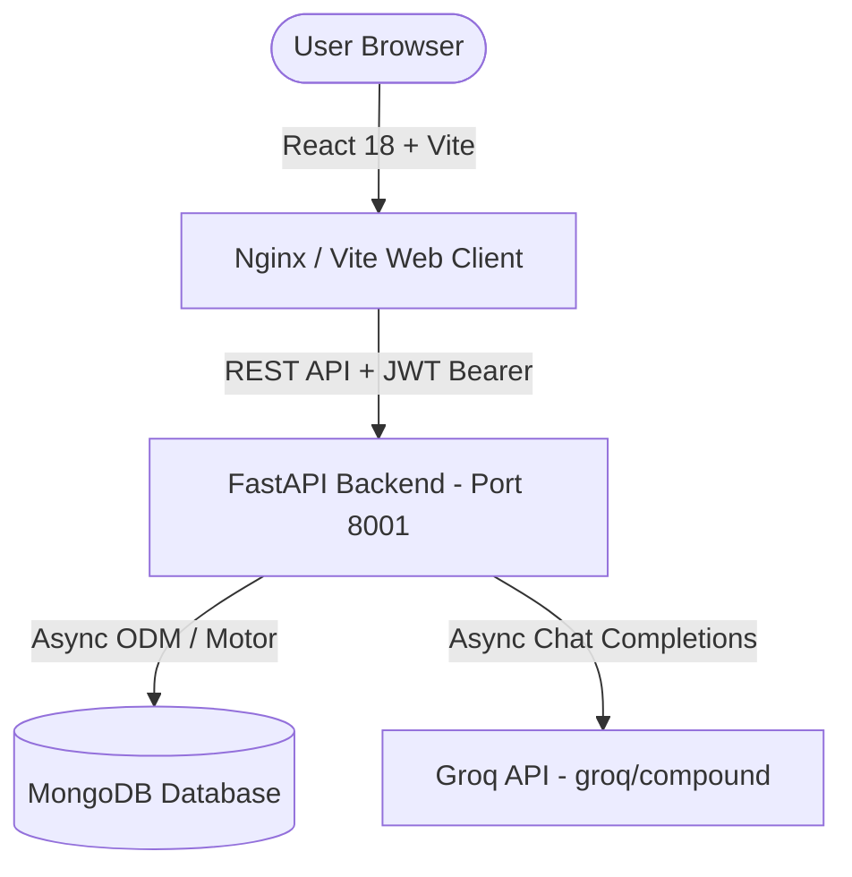

# Pathfinder AI 🗺️

[](https://fastapi.tiangolo.com/)
[](https://reactjs.org/)
[](https://groq.com/)
[](https://www.mongodb.com/)
[](https://www.docker.com/)
[](https://opensource.org/licenses/MIT)

> **A personalized, AI-powered learning navigator designed to generate dynamic quizzes, analyze student performance, and create actionable 4-day study plans.**

---

## 📌 Overview

**Pathfinder AI** transforms standard studying into an adaptive, feedback-driven experience. Instead of static, static learning paths, Pathfinder assesses a student's knowledge on **any topic**, pinpoints specific weak areas, and leverages high-speed LLMs (via Groq) to generate targeted study plans, beginner-friendly question explanations, and an interactive AI tutor.

---

## ✨ Core Features

### 🎓 For Students
- 🎯 **Dynamic Quiz Generation**: Enter any subject or topic to generate a unique 10-question multiple-choice quiz (3 Easy, 3 Medium, 3 Hard, 1 Extreme Hard).
- 📅 **Personalized 4-Day Study Plans**: Based on missed questions, Pathfinder builds a structured Markdown plan with core concepts, focus areas, practice tasks, and resource links.
- 💡 **On-Demand Explanations**: Click *"Explain this"* on any missed question in your quiz history for a beginner-friendly explanation.
- 🤖 **Interactive AI Tutor**: Ask follow-up questions to an embedded AI tutor within the context of your current study topic.
- 🏆 **Gamification & Analytics**: Earn points (10 pts/correct answer), build daily learning streaks, and track performance history via interactive Recharts graphs.
- 🔐 **Secure Authentication**: Full JWT-based authentication with persistent sessions and bcrypt password hashing.

### 🛡️ For Admins
- 📊 **Platform Activity Dashboard**: Role-protected page displaying registered users, user roles, and system-wide quiz results.
- 👥 **User Management**: Monitor platform adoption and user engagement metrics.

---

## 🏗️ Architecture & Technology Stack



| Component | Technology | Description |
| :--- | :--- | :--- |
| **Backend** | Python 3.11, FastAPI | Asynchronous REST backend engine |
| **AI LLM Engine** | Groq API (`groq/compound`) | High-speed LLM completion engine |
| **Database** | MongoDB & Motor | Asynchronous MongoDB driver & object management |
| **Authentication** | JWT (`python-jose`) & `bcrypt` | Secure token generation & salted password hashing |
| **Rate Limiting** | `slowapi` | Prevents API abuse & enforces per-IP request limits |
| **Frontend** | React 18, Vite, React Router | Fast, modern client SPA |
| **UI & Visuals** | Custom CSS, Canvas Constellation | Dark theme UI with dynamic background animation |
| **Data Viz** | Recharts | Performance analytics & history visualization |
| **Containerization** | Docker & Docker Compose | Container orchestration for MongoDB, API, and Nginx |
| **CI/CD** | GitHub Actions Workflow | Automated backend syntax linting and Vite frontend build |

---

## ⚡ Quickstart Guide

### Option 1: One-Command Setup with Docker Compose 🐳

Ensure you have [Docker Desktop](https://www.docker.com/products/docker-desktop/) installed.

1. **Clone the Repository**:
   ```bash
   git clone https://github.com/guruvishnu0501/PathFinder.ai.git
   cd PathFinder.ai
   ```

2. **Configure Environment Variables**:
   Create a `.env` file inside the `backend/` directory:
   ```env
   GROQ_API_KEY="your_groq_api_key_here"
   MONGO_URI="mongodb://mongodb:27017/"
   SECRET_KEY="generate_a_strong_random_secret_key"
   ```

3. **Build & Start Services**:
   ```bash
   docker-compose up --build
   ```

4. **Access the Application**:
   - **Frontend**: [http://localhost:5173](http://localhost:5173)
   - **Backend API**: [http://localhost:8001](http://localhost:8001)
   - **Swagger Docs**: [http://localhost:8001/docs](http://localhost:8001/docs)

---

### Option 2: Manual Local Development Setup 🛠️

#### Prerequisites
- **Python**: 3.11+
- **Node.js**: v18+ / v20+
- **MongoDB**: Community Server running locally on `mongodb://localhost:27017`

#### 1. Backend Setup
```bash
cd backend

# Create and activate virtual environment
python -m venv venv

# On Windows:
.\venv\Scripts\activate
# On Mac/Linux:
source venv/bin/activate

# Install dependencies
pip install -r requirements.txt

# Create .env file
cp .env.example .env
```

Edit `backend/.env` with your credentials:
```env
GROQ_API_KEY="your_groq_api_key_here"
MONGO_URI="mongodb://localhost:27017/"
SECRET_KEY="your_secure_secret_key"
```

Start the FastAPI server:
```bash
uvicorn main:app --port 8001 --reload
```

#### 2. Frontend Setup
In a second terminal:
```bash
cd frontend

# Install Node dependencies
npm install

# Start Vite dev server
npm run dev
```

The application will be live at [http://localhost:5173](http://localhost:5173).

---

## 🔑 Environment Variables Reference

| Variable | Required | Description | Example |
| :--- | :---: | :--- | :--- |
| `GROQ_API_KEY` | **Yes** | Groq API key from [console.groq.com](https://console.groq.com) | `gsk_...` |
| `MONGO_URI` | **Yes** | MongoDB connection URI | `mongodb://localhost:27017/` |
| `SECRET_KEY` | **Yes** | Cryptographic secret key for signing JWT tokens | `2c0cb51fbf5...` |

---

## 📡 API Endpoint Reference

| Method | Endpoint | Access | Description |
| :---: | :--- | :---: | :--- |
| `POST` | `/signup` | Public | Register a new user account |
| `POST` | `/token` | Public | Authenticate user & return JWT Bearer token |
| `GET` | `/profile` | User | Fetch current user stats (points, streak) |
| `POST` | `/generate-quiz` | User | Generate 10-question quiz on a given topic |
| `POST` | `/generate-plan` | User | Generate 4-day study plan from missed questions |
| `POST` | `/explain-question` | User | Get beginner-friendly explanation for a question |
| `POST` | `/ask-follow-up` | User | Send question to AI tutor chatbot |
| `POST` | `/save-result` | User | Save completed quiz results & update streak |
| `GET` | `/history` | User | Get user's quiz attempt history |
| `GET` | `/admin/users` | Admin | Retrieve list of all platform users |
| `GET` | `/admin/results` | Admin | Retrieve all platform quiz submissions |

---

## 👑 Creating an Admin User

1. Register a new account through the web UI ([http://localhost:5173/signup](http://localhost:5173/signup)).
2. Open **MongoDB Compass** (or `mongosh`) and connect to `mongodb://localhost:27017`.
3. Open the `pathfinder_db` database and select the `users` collection.
4. Locate your user document and update the `role` field from `"user"` to `"admin"`:
   ```json
   {
     "role": "admin"
   }
   ```
5. Log in again to access the **Admin Dashboard** at `/admin`.

---

## 🧪 Running CI Checks

The repository includes GitHub Actions CI workflows for automated linting and build validation.

- **Backend Syntax Check**: `flake8 . --count --select=E9,F63,F7,F82 --show-source --statistics`
- **Frontend Build Verification**: `npm run build`

---

## 🤝 Contributing & Contributors

Contributions, issues, and feature requests are welcome! Feel free to check out [CONTRIBUTING.md](CONTRIBUTING.md) for contribution guidelines.

### Lead Maintainer & Author
- **[@guruvishnu0501](https://github.com/guruvishnu0501)** — *Project Creator & Lead Architect*

---

## 📄 License

This project is open-source and licensed under the **[MIT License](LICENSE)**.
